# Hyperion Ultra-Lightweight AI Framework Design Document

## Overview

Hyperion is an extremely memory-efficient, cross-platform AI framework designed to run sophisticated machine learning models on minimal hardware, including legacy systems. The framework achieves unprecedented memory efficiency through 4-bit quantization, reducing model sizes by up to 8x compared to traditional 32-bit implementations, enabling models to operate in as little as 50-100MB of RAM.

### Key Design Principles
- **Memory Efficiency First**: 4-bit quantization and sparse matrix support for minimal memory footprint
- **Zero External Dependencies**: Pure C implementation for maximum portability
- **Progressive Loading**: On-demand component loading to minimize resource usage
- **Hybrid Execution**: Seamless switching between local and remote processing
- **Cross-Platform Compatibility**: Support for modern to legacy hardware systems

## Architecture

### System Architecture Overview

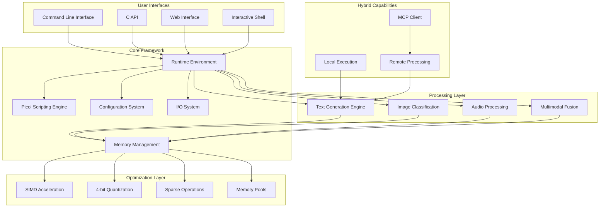

### Core Components Architecture

#### Picol Scripting Engine
The foundation scripting environment providing extended Tcl interpretation capabilities.

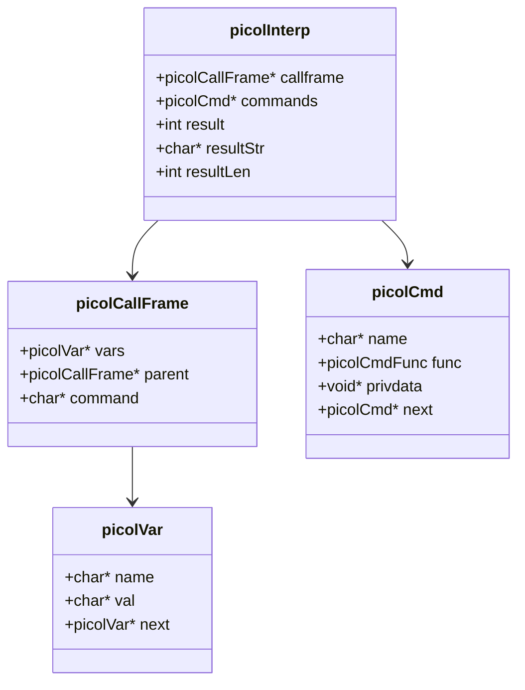

#### Memory Management System

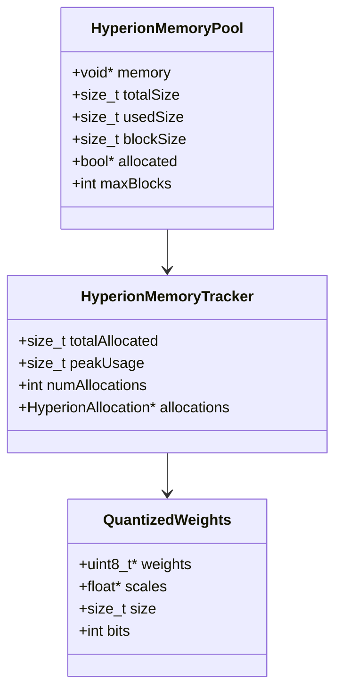

## Multimodal Processing Architecture

### Text Generation Engine

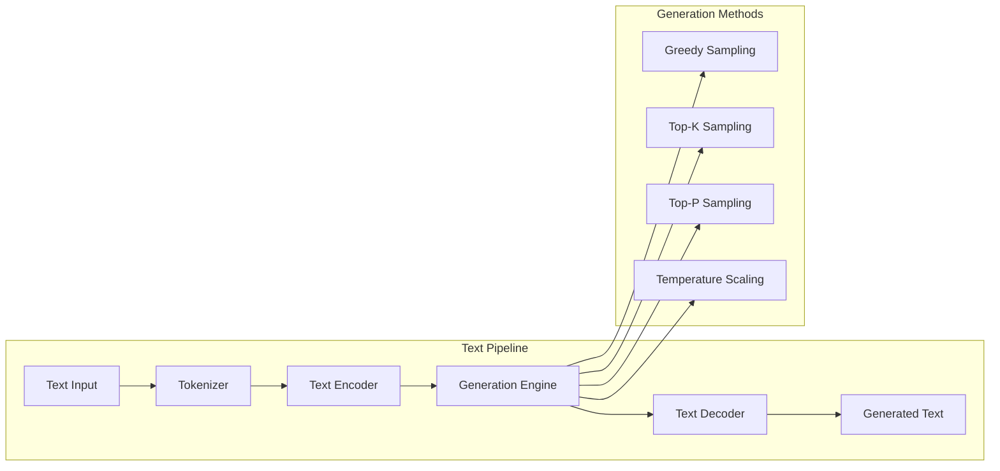

### Image Classification System

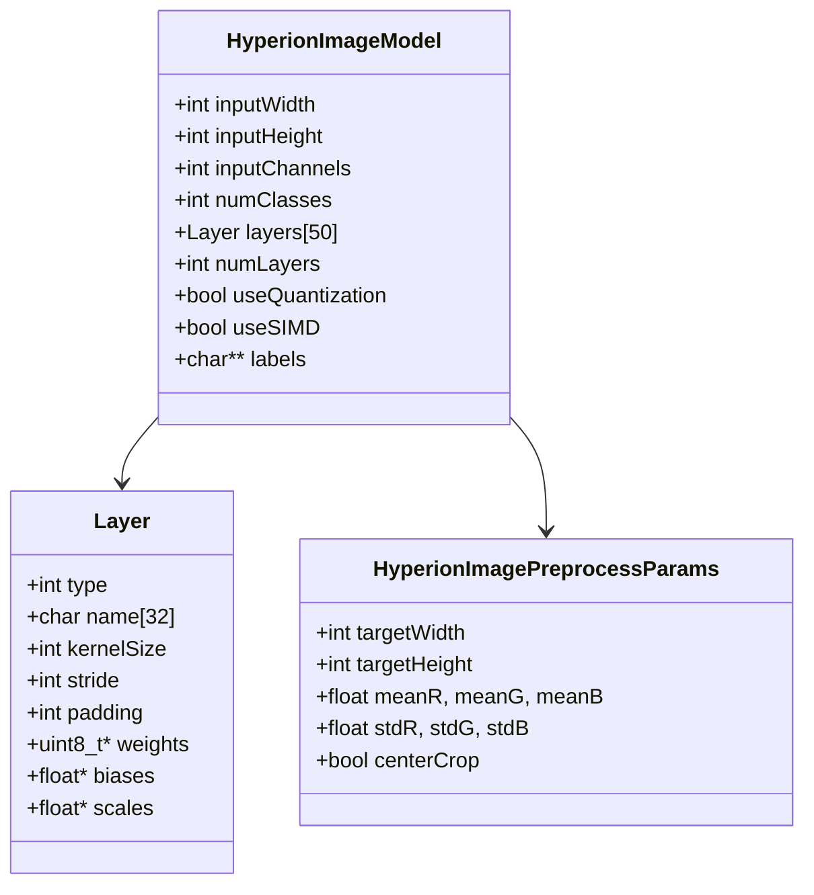

### Audio Processing Architecture

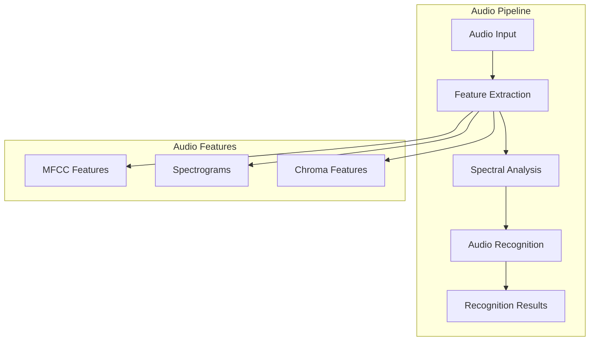

### Multimodal Fusion System

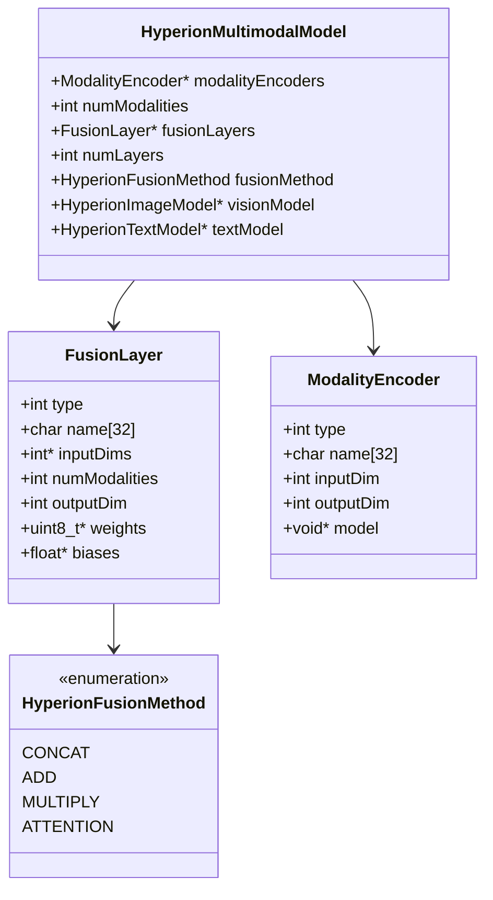

## Data Flow Architecture

### Image Classification Pipeline

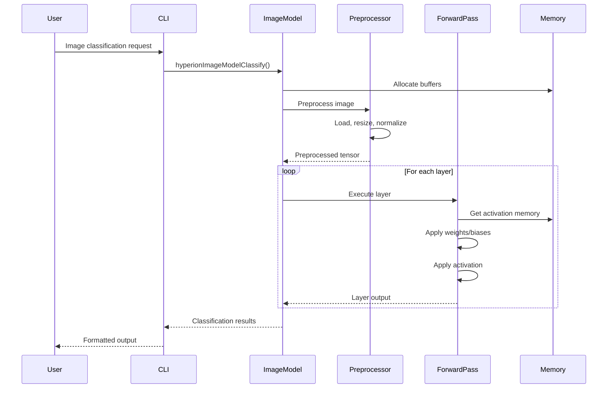

### Hybrid Execution Flow

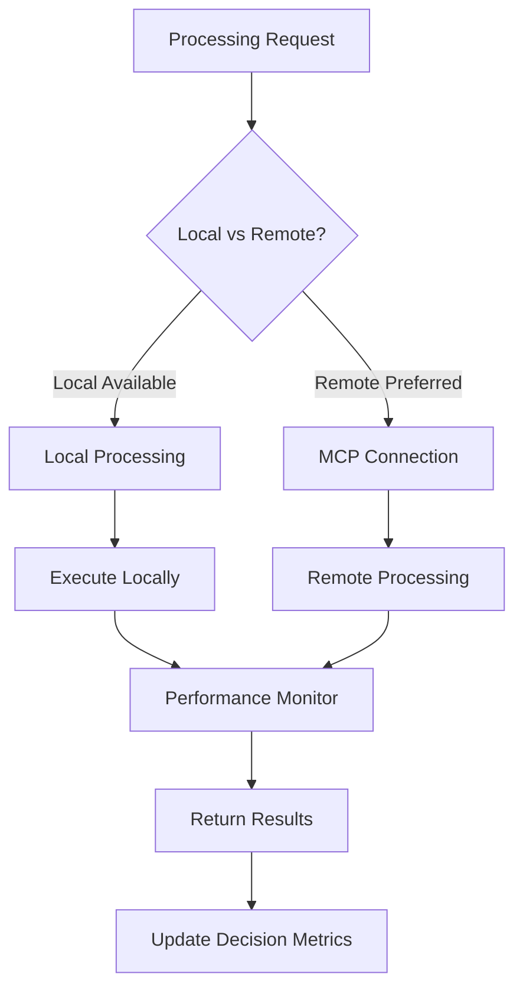

## User Interface Architecture

### Command Line Interface

| Command Category | Commands | Description |
|-----------------|----------|-------------|
| **Model Management** | `model load`, `model info`, `model list` | Model lifecycle operations |
| **Text Generation** | `generate`, `tokenize` | Text processing operations |
| **Image Processing** | `classify`, `preprocess` | Image analysis operations |
| **Audio Processing** | `recognize`, `extract-features` | Audio processing operations |
| **Multimodal** | `caption`, `qa` | Cross-modal operations |
| **Hybrid Control** | `hybrid on/off`, `mcp connect` | Execution mode management |
| **Configuration** | `config set`, `config get` | System configuration |
| **Utilities** | `help`, `version`, `benchmark` | Support operations |

### API Interface Structure

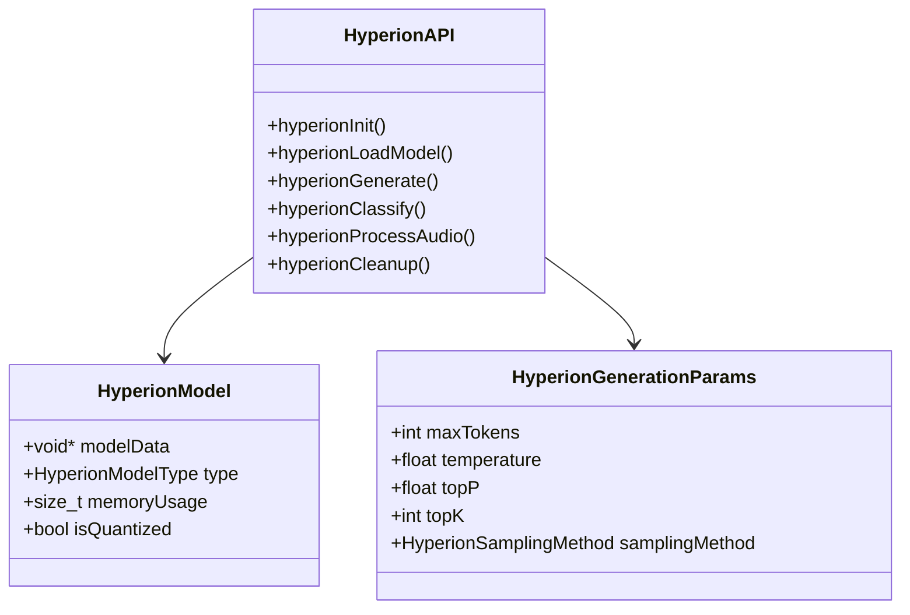

## Memory Optimization Strategy

### 4-bit Quantization Implementation

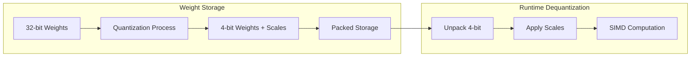

### Memory Pool Management

| Pool Type | Purpose | Size Strategy | Allocation Pattern |
|-----------|---------|---------------|-------------------|
| **Model Pool** | Weight storage | Fixed, model-dependent | Long-lived |
| **Activation Pool** | Intermediate results | Dynamic, layer-dependent | Short-lived |
| **Buffer Pool** | I/O operations | Configurable | Reusable |
| **Temporary Pool** | Scratch space | Small, fixed | Very short-lived |

## Performance Optimization

### SIMD Acceleration Strategy

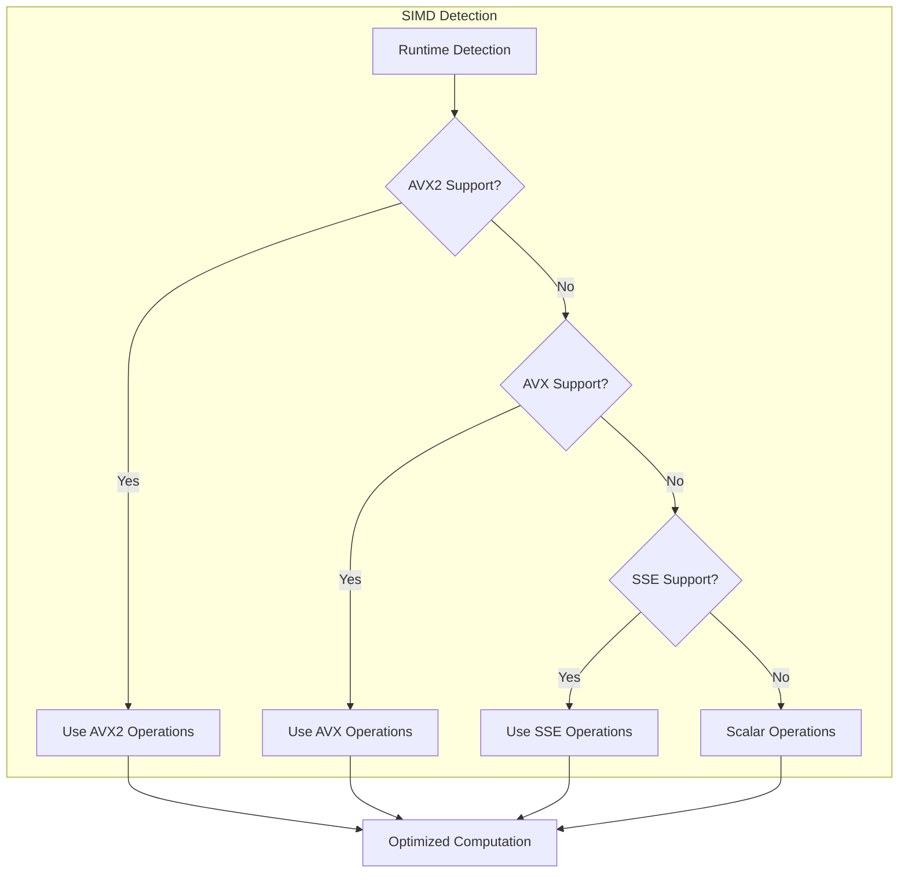

### Layer-Specific Optimizations

| Layer Type | Optimization Techniques | Memory Pattern |
|------------|------------------------|----------------|
| **Convolutional** | SIMD vectorization, cache tiling | Sequential access |
| **Depthwise** | Channel parallelization | Strided access |
| **Fully Connected** | Matrix blocking, quantized GEMM | Random access |
| **Pooling** | SIMD reduction operations | Regular stride |
| **Activation** | Vectorized functions | In-place computation |

## Configuration System

### Configuration Hierarchy

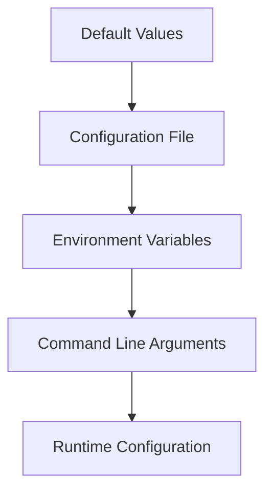

### Configuration Categories

| Category | Parameters | Default Values |
|----------|------------|----------------|
| **Memory** | `pool_size`, `max_allocations`, `track_leaks` | 1MB, 10000, true |
| **Model** | `context_size`, `hidden_size`, `quantization` | 512, 256, enabled |
| **Generation** | `temperature`, `top_k`, `top_p` | 0.7, 40, 0.9 |
| **Performance** | `use_simd`, `num_threads`, `cache_size` | auto, auto, 64KB |
| **Hybrid** | `prefer_local`, `mcp_timeout`, `performance_threshold` | true, 5000ms, 2.0x |

## Testing Strategy

### Test Categories

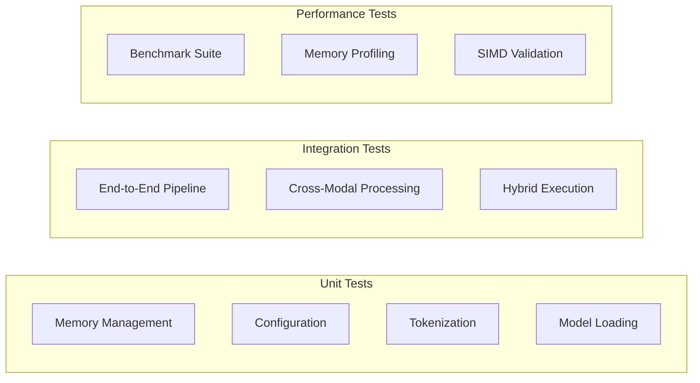

### Test Infrastructure

| Test Type | Framework | Coverage | Automation |
|-----------|-----------|----------|------------|
| **Unit Tests** | Custom C framework | Core components | CI/CD pipeline |
| **Integration Tests** | End-to-end scenarios | Full workflows | Nightly builds |
| **Performance Tests** | Benchmark utilities | Critical paths | Performance regression |
| **Memory Tests** | Valgrind, AddressSanitizer | Memory operations | Debug builds |

## Hybrid Execution Model

### MCP Integration Architecture

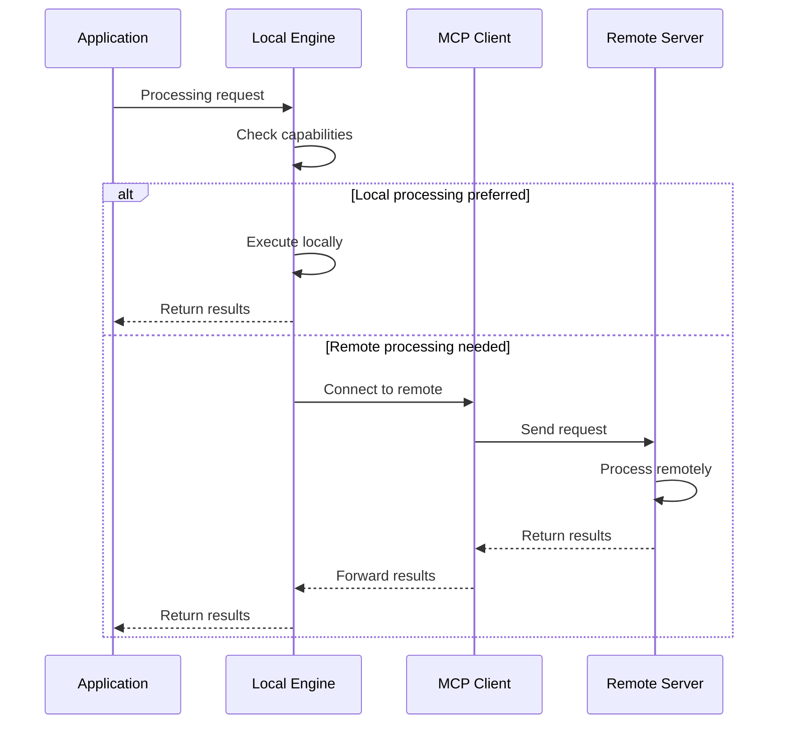

### Performance Decision Matrix

| Factor | Local Preference | Remote Preference |
|--------|------------------|-------------------|
| **Model Size** | < 100MB | > 500MB |
| **Processing Time** | < 100ms expected | > 1s expected |
| **Network Latency** | > 100ms | < 50ms |
| **Memory Available** | > 2x model size | < model size |
| **Power Constraints** | Battery critical | AC powered |