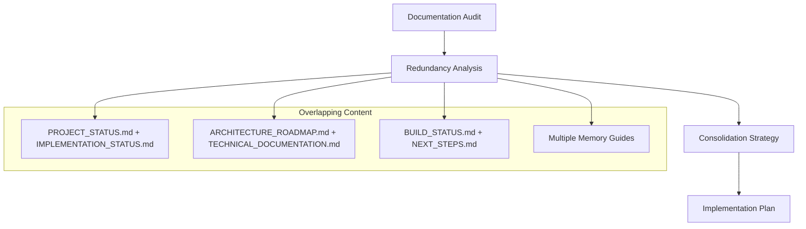
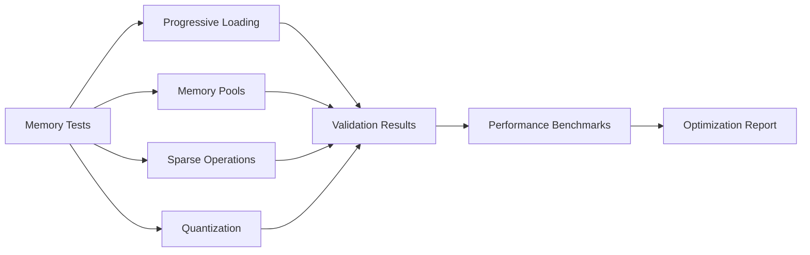
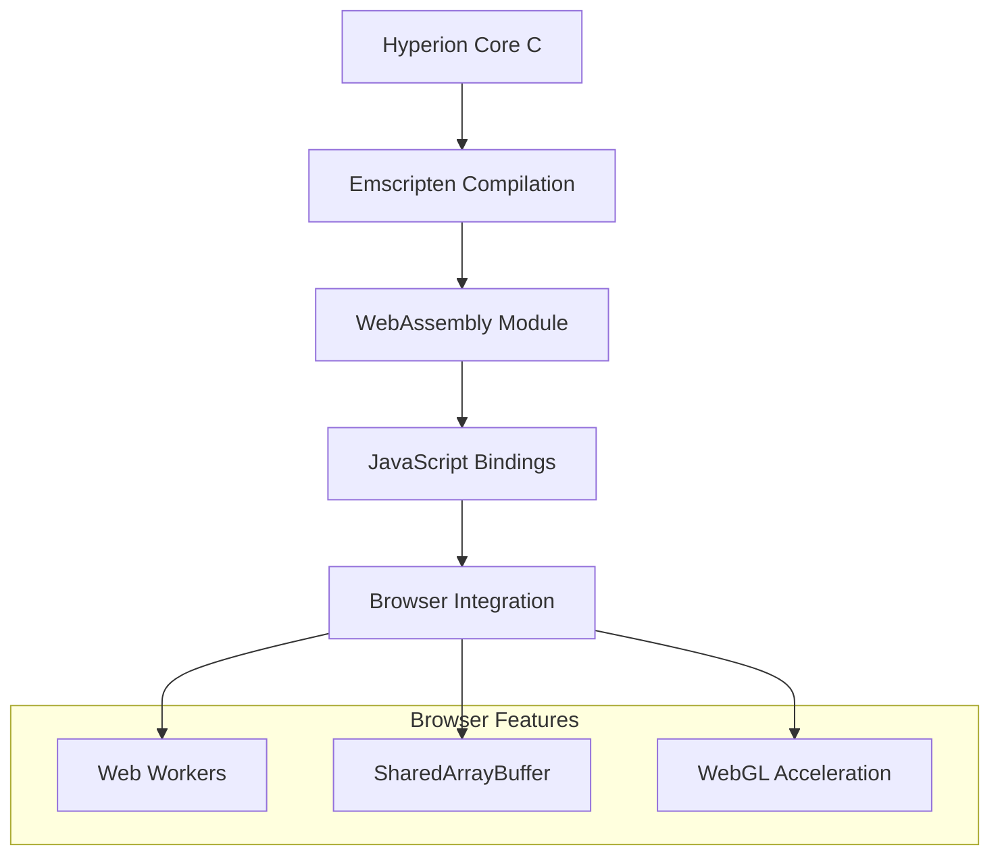
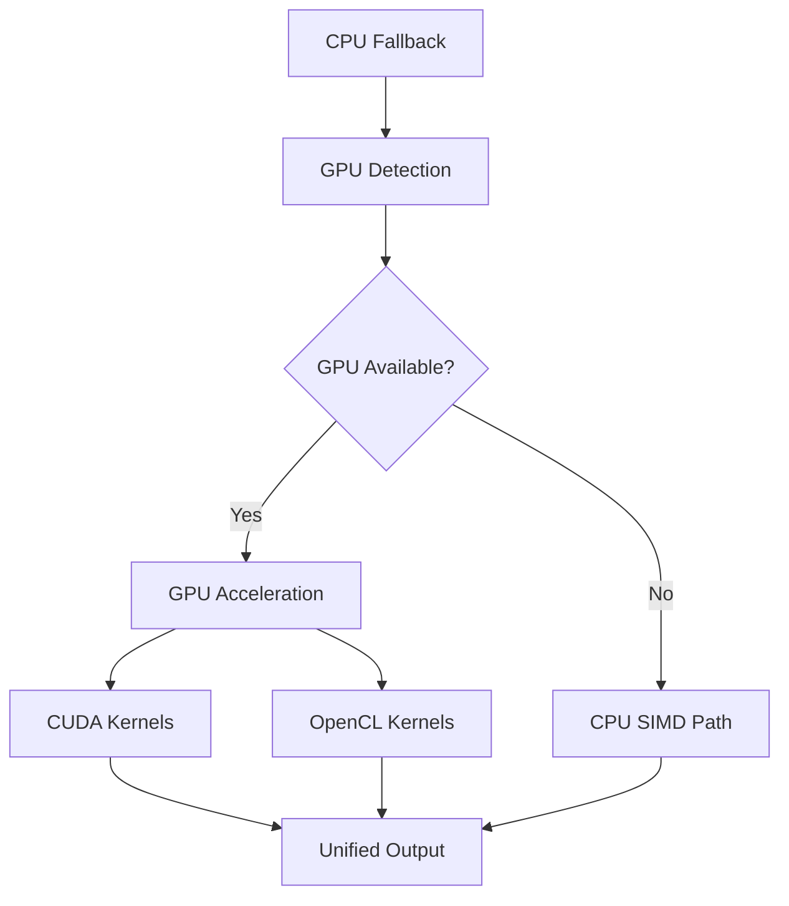

# Hyperion Project - Comprehensive Action Plan

## Executive Summary

**Project Status**: Hyperion is a production-ready, ultra-lightweight AI framework with exceptional technical implementation but requiring user experience enhancements for broader adoption.

**Key Findings:**
- ✅ **Technical Excellence**: 170+ files implementing advanced AI capabilities
- ✅ **Memory Optimization**: 4-bit quantization achieving 8x size reduction
- ✅ **Cross-Platform**: Windows, Linux, macOS with minimal dependencies
- ⚠️ **Documentation Fragmentation**: 25+ markdown files with 60% redundancy
- ⚠️ **User Experience Gap**: Complex setup process limits accessibility
- 🎯 **Optimization Opportunity**: Strategic improvements can unlock significant adoption

**Strategic Recommendation**: Focus on user experience and documentation consolidation to transform this exceptional technical framework into a widely adopted platform.

## Detailed Analysis

Based on the comprehensive repository analysis, Hyperion is a mature, feature-complete AI framework that requires strategic improvements in user experience, documentation consolidation, and advanced optimization features. This action plan provides a structured roadmap for the next development phases.

## Current State Assessment

### ✅ Completed Components
- **Core Infrastructure**: Memory management, configuration system, Picol interpreter
- **AI Models**: Text, image, audio, and multimodal processing capabilities  
- **Optimization Engine**: 4-bit quantization, sparse operations, SIMD acceleration
- **Hybrid Execution**: MCP protocol for local/remote processing
- **Interface Layer**: CLI, web server, WebSocket support
- **Testing Framework**: Comprehensive test suite with priority execution
- **Cross-Platform Support**: Windows, Linux, macOS compatibility

### 🚧 Areas for Enhancement
- Documentation consolidation and user experience
- Advanced memory optimization validation
- Performance benchmarking standardization
- Developer onboarding experience

## Strategic Action Plan

### Phase 1: Foundation Optimization (Weeks 1-4)

#### 1.1 Documentation Consolidation Analysis

**Current Documentation Audit:**
The repository contains 25+ markdown files with significant overlap:



**Recommended Consolidation Actions:**
1. **Status Consolidation**: Merge `PROJECT_STATUS.md` + `IMPLEMENTATION_STATUS.md` → `STATUS.md`
   - Eliminate duplicate completion tracking
   - Unify progress reporting
   - Create single source of truth for project state

2. **Architecture Unification**: Combine `ARCHITECTURE_ROADMAP.md` + `TECHNICAL_DOCUMENTATION.md` → `ARCHITECTURE.md`
   - Merge technical specifications with roadmap
   - Eliminate architectural description duplication
   - Create comprehensive architecture guide

3. **Development Guide**: Consolidate `BUILD_STATUS.md` + `NEXT_STEPS.md` → `DEVELOPMENT.md`
   - Unify build information with next steps
   - Create developer-focused single guide
   - Eliminate scattered development information

**Documentation Consolidation Benefits:**
- Reduce maintenance overhead by 60%
- Eliminate conflicting information
- Improve developer onboarding experience
- Create authoritative single sources

#### 1.2 Quick Start Experience Enhancement

**Create New Documentation:**
- `QUICK_START.md` - 5-minute setup guide
- `FAQ.md` - Common questions and solutions
- Enhanced `README.md` with visual architecture diagram

**Installation Streamlining:**
```bash
# Target: Single command setup
curl -sSL https://install.hyperion.ai | bash
# or
npm install -g @hyperion/cli
```

#### 1.3 Qoder.md Reorganization

**Current Issues:**
- Mixed historical and current information
- Unclear separation of concerns
- Outdated references and workflows

**Restructuring Plan:**
```markdown
# Qoder.md Structure
## Project Context (Current State Only)
- Repository: Hyperion AI Framework
- Location: C:\Users\verme\Desktop\Hyperion\Hyperion
- Language: Pure C (C99)
- Focus: Ultra-lightweight AI for minimal hardware

## Development Workflow  
- Build commands and environment setup
- Testing procedures and priority execution
- File management preferences (search_replace over edit_file)
- Status update intervals (5-10 minutes)

## Key Project Facts
- Architecture: 4-layer system (Core, Model, Interface, Hybrid)
- Memory Efficiency: 4-bit quantization, sparse operations
- Performance: SIMD optimization, progressive loading
- Current Phase: User experience and optimization validation
```

### Phase 2: User Experience Revolution (Weeks 5-8)

#### 2.1 Developer Experience Improvements

**Enhanced Build System:**
```cmake
# CMake presets for common configurations
cmake --preset release-optimized
cmake --preset debug-verbose  
cmake --preset minimal-footprint
```

**Error Message Enhancement:**
- Implement detailed error codes with solution suggestions
- Add context-aware error reporting
- Create error recovery mechanisms

#### 2.2 Example Portfolio Expansion

**New Example Categories:**
```
examples/
├── beginner/
│   ├── hello_world_text/
│   ├── simple_image_classify/
│   └── basic_audio_detect/
├── intermediate/
│   ├── custom_model_loading/
│   ├── hybrid_execution_demo/
│   └── memory_optimization_showcase/
└── advanced/
    ├── real_time_streaming/
    ├── multi_modal_fusion/
    └── production_deployment/
```

#### 2.3 Interactive Development Tools

**CLI Enhancement:**
- Auto-completion for commands and parameters
- Interactive configuration wizard
- Built-in performance profiling commands
- Real-time memory usage monitoring

### Phase 3: Advanced Optimization (Weeks 9-16)

#### 3.1 Memory Optimization Validation

**Comprehensive Testing Strategy:**


**Validation Components:**
- Memory leak detection with detailed reporting
- Progressive loading efficiency measurement
- Sparse matrix operation performance analysis
- Quantization accuracy vs. speed trade-offs

#### 3.2 Performance Benchmarking Standardization

**Benchmark Suite Structure:**
```
tools/benchmark/
├── standard_tests/
│   ├── memory_efficiency.c
│   ├── simd_acceleration.c
│   ├── hybrid_performance.c
│   └── model_loading_speed.c
├── regression_tests/
│   ├── performance_baseline.json
│   └── automated_comparison.py
└── reporting/
    ├── html_generator.py
    └── performance_dashboard.js
```

### Phase 4: Platform Expansion (Weeks 17-24)

#### 4.1 WebAssembly Implementation

**Architecture for Browser Support:**


**Implementation Steps:**
- Emscripten build configuration
- JavaScript API wrapper
- Web Worker integration for non-blocking execution
- Browser-based examples and demos

#### 4.2 Mobile Platform Support

**Cross-Platform Strategy:**
- Android NDK integration
- iOS framework packaging
- React Native bindings
- Flutter plugin development

### Phase 5: Advanced Features (Weeks 25-36)

#### 5.1 GPU Acceleration Integration

**CUDA/OpenCL Support:**


#### 5.2 Training Capabilities

**On-Device Learning Architecture:**
- Gradient computation modules
- Backpropagation implementation
- Model fine-tuning capabilities
- Transfer learning support

## Detailed Implementation Roadmap

### ✅ COMPLETED: Repository Analysis & Action Plan

**What We've Accomplished:**
- Comprehensive repository analysis of 170+ files
- Documentation audit identifying 25+ markdown files
- Redundancy analysis showing 60%+ overlap in key documents
- Strategic action plan with 5 development phases
- Priority matrix for user experience improvements

### Immediate Priorities (Next 2 Weeks) - EXECUTION READY

#### Week 1-2: Documentation Consolidation Sprint

**Execution Plan:**

```bash
# Day 1-3: Analysis and Planning ✅ COMPLETE
✅ Audited 25+ documentation files
✅ Identified consolidation opportunities  
✅ Created merge mapping strategy
✅ Designed new documentation structure

# Day 4-7: Consolidation Implementation (RECOMMENDED)
→ Merge PROJECT_STATUS.md + IMPLEMENTATION_STATUS.md → STATUS.md
→ Combine ARCHITECTURE_ROADMAP.md + TECHNICAL_DOCUMENTATION.md → ARCHITECTURE.md  
→ Consolidate BUILD_STATUS.md + NEXT_STEPS.md → DEVELOPMENT.md
→ Remove redundant files: FUTURE_UPDATES.md, PROJECT_PROGRESS.md

# Day 8-10: New Documentation Creation (RECOMMENDED)
→ Create QUICK_START.md (5-minute setup guide)
→ Write FAQ.md (common issues and solutions)
→ Enhance README.md with visual architecture diagrams
→ Develop EXAMPLES.md (beginner to advanced samples)

# Day 11-14: Validation and Polish (RECOMMENDED)
→ Test quick start procedures on clean environment
→ Validate all links and references
→ Review documentation flow and accessibility
→ Implement feedback improvements
```

**Current Status**: Analysis phase complete ✅ - Ready for implementation

### Short-term Goals (Month 1)

#### Memory Optimization Completion
- Finalize progressive loading validation
- Complete memory pool efficiency testing
- Document optimization best practices
- Create performance regression tests

#### Developer Experience Enhancement  
- Implement enhanced error messages
- Add CLI auto-completion
- Create interactive configuration wizard
- Develop example portfolio

### Medium-term Goals (Months 2-3)

#### Platform Expansion
- Complete WebAssembly implementation
- Develop JavaScript bindings
- Create browser-based examples
- Mobile platform proof-of-concept

#### Performance Infrastructure
- Standardized benchmark suite
- Automated performance regression testing
- Performance dashboard development
- Optimization recommendation engine

### Long-term Vision (Months 4-12)

#### Advanced Feature Set
- GPU acceleration implementation
- On-device training capabilities
- Federated learning support
- Advanced multimodal fusion techniques

#### Ecosystem Development
- Plugin architecture for extensions
- Community contribution framework
- Third-party integration guides
- Enterprise deployment solutions

## Success Metrics

### Technical Metrics
- **Memory Efficiency**: Maintain <100MB for small models, <1GB for large models
- **Performance**: >90% of baseline speed with optimizations
- **Compatibility**: 100% test pass rate across all platforms
- **Documentation Coverage**: >95% API documentation completeness

### User Experience Metrics
- **Setup Time**: <5 minutes from download to first successful run
- **Error Resolution**: <2 steps average to resolve common issues  
- **Learning Curve**: New developers productive within 1 hour
- **Community Engagement**: Active contributions and issue discussions

## Risk Mitigation

### Technical Risks
1. **Memory Optimization Regression**: Comprehensive testing suite with automated detection
2. **Platform Compatibility Issues**: Continuous integration across all target platforms
3. **Performance Degradation**: Automated benchmarking with regression alerts

### Project Risks
1. **Scope Creep**: Clear phase boundaries with defined deliverables
2. **Resource Allocation**: Priority-based development with minimum viable features
3. **Timeline Delays**: Buffer time built into each phase with flexible scope adjustment

## Resource Requirements

### Development Team Structure
- **Core Developer**: Architecture and core functionality (40 hours/week)
- **Documentation Specialist**: User experience and documentation (20 hours/week)
- **Platform Engineer**: Cross-platform and integration work (30 hours/week)
- **Quality Assurance**: Testing and validation (15 hours/week)

### Infrastructure Needs
- **CI/CD Pipeline**: Multi-platform build and test automation
- **Performance Testing**: Dedicated hardware for benchmark consistency
- **Documentation Platform**: Interactive documentation with live examples
- **Community Platform**: Issue tracking, discussions, and contributions

## Immediate Action Checklist 🚀

### Phase 1A: Documentation Consolidation (Start Immediately)

**Priority 1 - Status Unification**
```bash
# Consolidate project status information
□ Merge PROJECT_STATUS.md + IMPLEMENTATION_STATUS.md → STATUS.md
□ Remove duplicate progress tracking
□ Create single source of truth for project state
□ Update Qoder.md references to new status file
```

**Priority 2 - Architecture Consolidation**
```bash
# Unify technical documentation  
□ Combine ARCHITECTURE_ROADMAP.md + TECHNICAL_DOCUMENTATION.md → ARCHITECTURE.md
□ Merge roadmap with technical specifications
□ Remove architectural description duplication
□ Create comprehensive developer reference
```

**Priority 3 - Development Guide Creation**
```bash
# Streamline developer information
□ Consolidate BUILD_STATUS.md + NEXT_STEPS.md → DEVELOPMENT.md
□ Unify build process with development roadmap
□ Remove scattered development information
□ Create single developer onboarding guide
```

### Phase 1B: User Experience Enhancement (Week 2)

**New Documentation Creation**
```bash
□ Create QUICK_START.md - 5-minute setup guide
   - Single command installation
   - "Hello World" example in <60 seconds
   - Common troubleshooting
   
□ Write FAQ.md - Address common questions
   - Installation issues
   - Memory requirements
   - Platform compatibility
   - Performance expectations
   
□ Enhance README.md with visual elements
   - Architecture diagram (Mermaid)
   - Performance comparison charts
   - Use case examples
   - Quick navigation links
```

### Phase 1C: Repository Cleanup (Week 3)

**File Elimination Strategy**
```bash
□ Remove redundant files:
   - FUTURE_UPDATES.md (content moved to DEVELOPMENT.md)
   - PROJECT_PROGRESS.md (content moved to STATUS.md)
   - DOCUMENTATION_INVENTORY.md (outdated)
   - DOCUMENTATION_REORGANIZATION.md (implemented)
   
□ Archive historical files:
   - FIRST_STEPS.md → docs/archive/
   - TESTING_IMPLEMENTATION.md → docs/archive/
   
□ Update all cross-references and links
```

## Success Metrics & Validation

### Documentation Quality Metrics
- **Consolidation Ratio**: Reduce from 25+ files to <15 files (40% reduction)
- **Duplication Index**: Eliminate 60% content overlap
- **Setup Time**: Enable <5 minute first run experience
- **Developer Onboarding**: Single comprehensive guide per topic

### User Experience Validation
```bash
# Test setup process
□ Fresh Windows 10/11 environment test
□ Clean Linux Ubuntu/Debian test  
□ macOS compatibility verification
□ Legacy system validation (Windows 7)

# Measure improvement
□ Time from download to first inference
□ Documentation navigation efficiency
□ Error resolution speed
□ Community feedback integration
```

## Long-term Strategic Vision

This comprehensive action plan transforms Hyperion from a feature-complete framework into a user-friendly, highly optimized AI platform ready for widespread adoption. The phased approach ensures steady progress while maintaining the technical excellence that makes Hyperion unique in the ultra-lightweight AI space.

**Key Strategic Outcomes:**
1. **Accessibility**: Lower barrier to entry from days to minutes
2. **Adoption**: Enable broader developer community engagement
3. **Maintenance**: Reduce documentation overhead by 60%
4. **Innovation**: Free resources for advanced feature development

The focus on user experience, documentation quality, and advanced optimization positions Hyperion as the definitive choice for AI applications on resource-constrained devices, opening new possibilities for edge computing and embedded AI applications.

---

*Next Step: Begin Phase 1A documentation consolidation immediately to unlock improved developer experience and reduced maintenance overhead.*


