# Hyperion Ultra-Lightweight AI Framework - Design Analysis

## Overview

Hyperion is an ultra-lightweight AI framework designed for memory-constrained environments, featuring 4-bit quantization, cross-platform compatibility, and hybrid local/remote execution capabilities. Built entirely in C with minimal dependencies, it targets legacy systems and resource-limited devices while maintaining high performance through SIMD optimization.

### Key Characteristics

- **Memory Efficiency**: 4-bit quantization reduces model size by up to 8x
- **Hardware Compatibility**: Runs on minimal hardware (50-100MB RAM)
- **Cross-Platform**: Pure C implementation with no external dependencies
- **Multi-Modal**: Supports text, image, audio, and multimodal AI models
- **Hybrid Execution**: Seamless switching between local and remote processing

## Architecture

The Hyperion framework follows a layered architecture optimized for memory efficiency and modularity:

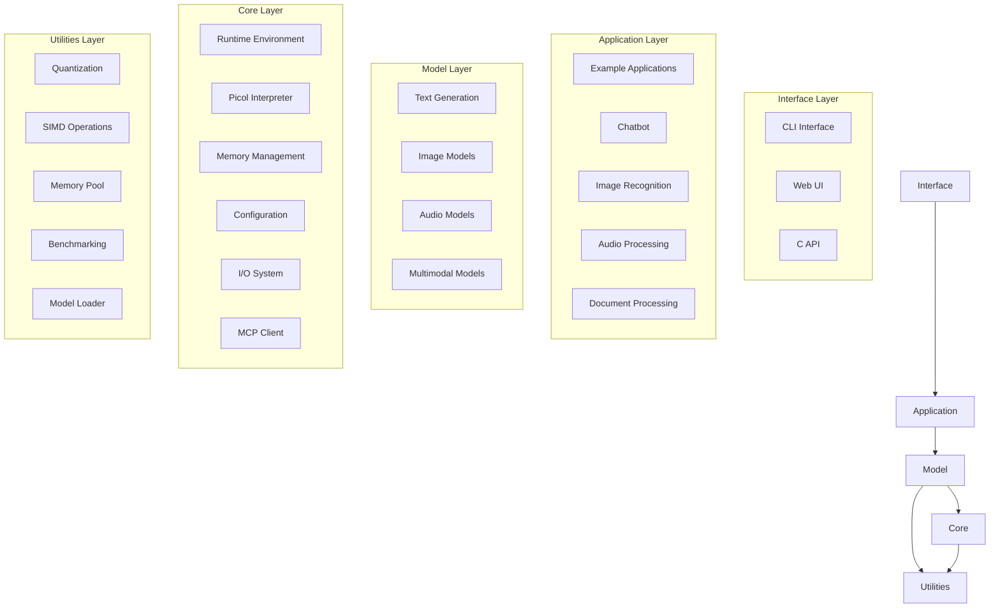

### Core Components

#### 1. Runtime Environment (`core/runtime.h`)
- **Module System**: Dynamic module loading and dependency management
- **Resource Management**: Automatic resource tracking and cleanup
- **Error Handling**: Centralized error management with type classification
- **Event System**: Event-driven architecture for component communication

#### 2. Memory Management (`core/memory.h`)
- **Memory Pools**: Efficient allocation with leak tracking
- **4-bit Quantization**: Advanced quantization for weight compression
- **Progressive Loading**: On-demand component loading
- **Memory Monitoring**: Real-time memory usage tracking

#### 3. Picol Interpreter (`core/picol.h`)
- **Extended Tcl**: Scripting environment for configuration and automation
- **Command Registration**: Dynamic command system
- **Variable Management**: Scoped variable handling
- **Expression Evaluation**: Built-in expression parser

## Model Architecture

### Text Generation Models

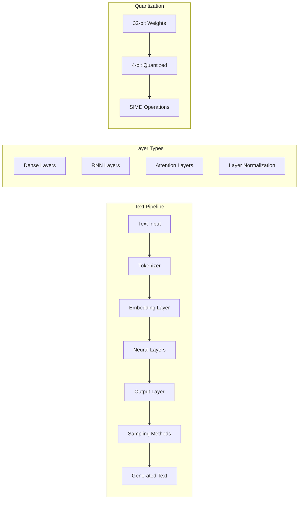

**Layer Configuration:**
- **Embedding Layer**: Token to vector conversion with 4-bit quantization
- **Dense Layers**: Fully connected layers with bias support
- **RNN Layers**: Recurrent processing for sequential data
- **Attention Layers**: Multi-head attention mechanism for transformers
- **Output Layer**: Vocabulary projection with sampling strategies

**Sampling Methods:**
- Greedy sampling for deterministic output
- Temperature-based sampling for creativity control
- Top-K sampling for quality filtering
- Top-P (nucleus) sampling for dynamic vocabulary

### Image Recognition Models

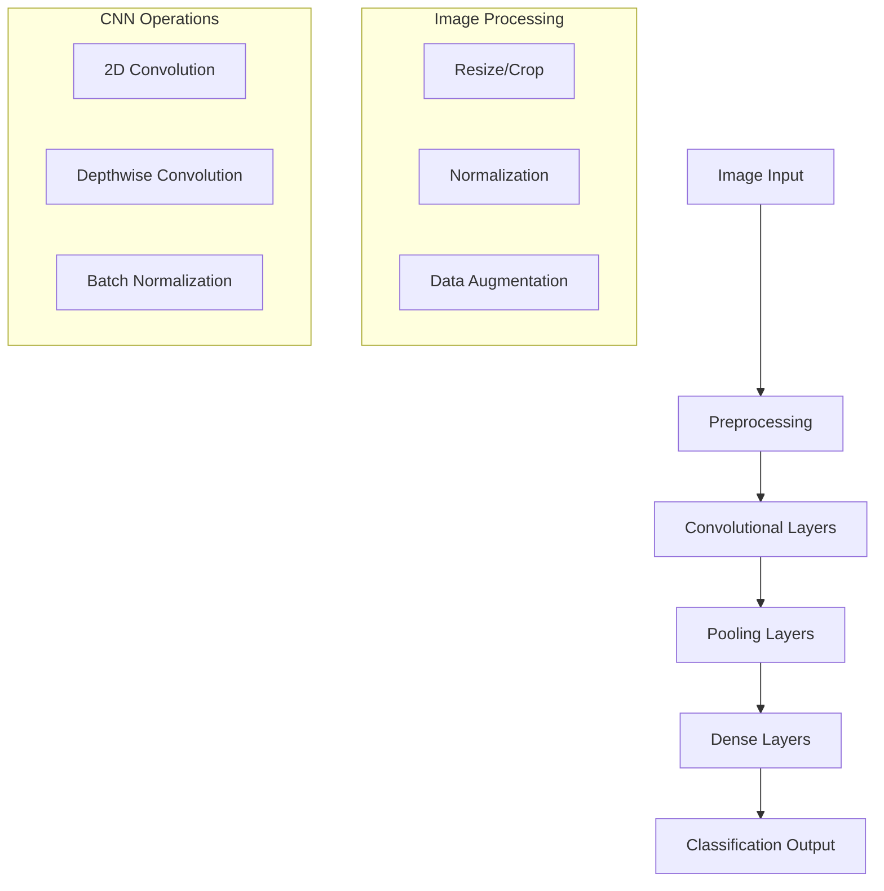

**Image Model Features:**
- **STB Image Loader**: Lightweight image loading without external dependencies
- **Convolutional Operations**: Optimized 2D convolution with SIMD acceleration
- **Depthwise Convolution**: Memory-efficient convolution for mobile architectures
- **Forward Pass**: Efficient inference pipeline with activation caching

### Audio Processing Models

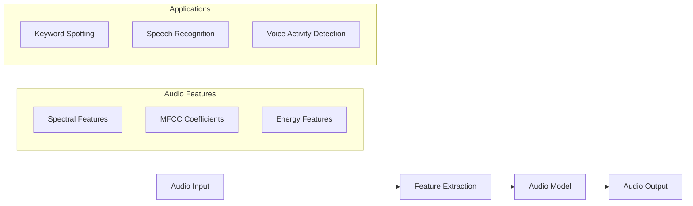

### Multimodal Models

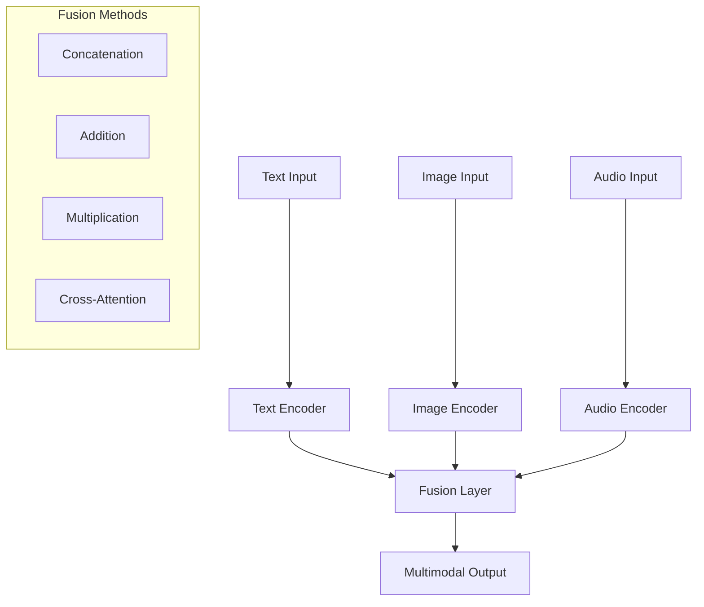

## Quantization System

### 4-bit Quantization Strategy

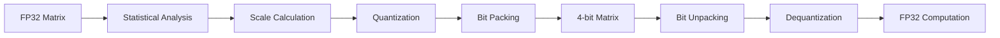

**Quantization Components:**
- **HyperionMatrix4bit**: 4-bit matrix storage with scale and zero-point
- **HyperionMatrix8bit**: 8-bit matrix for intermediate precision
- **Sparse Matrix Support**: CSR format with 4-bit quantization for 98% memory reduction
- **Mixed Precision**: Dynamic precision switching based on layer requirements

### Memory Layout Optimization

| Component | Memory Usage | Optimization |
|-----------|--------------|--------------|
| Model Weights | 75% reduction | 4-bit quantization |
| Activations | 50% reduction | Progressive loading |
| Context Buffer | Dynamic sizing | Sliding window |
| Temporary Buffers | Pool allocation | Memory reuse |

## SIMD Acceleration

### Instruction Set Support

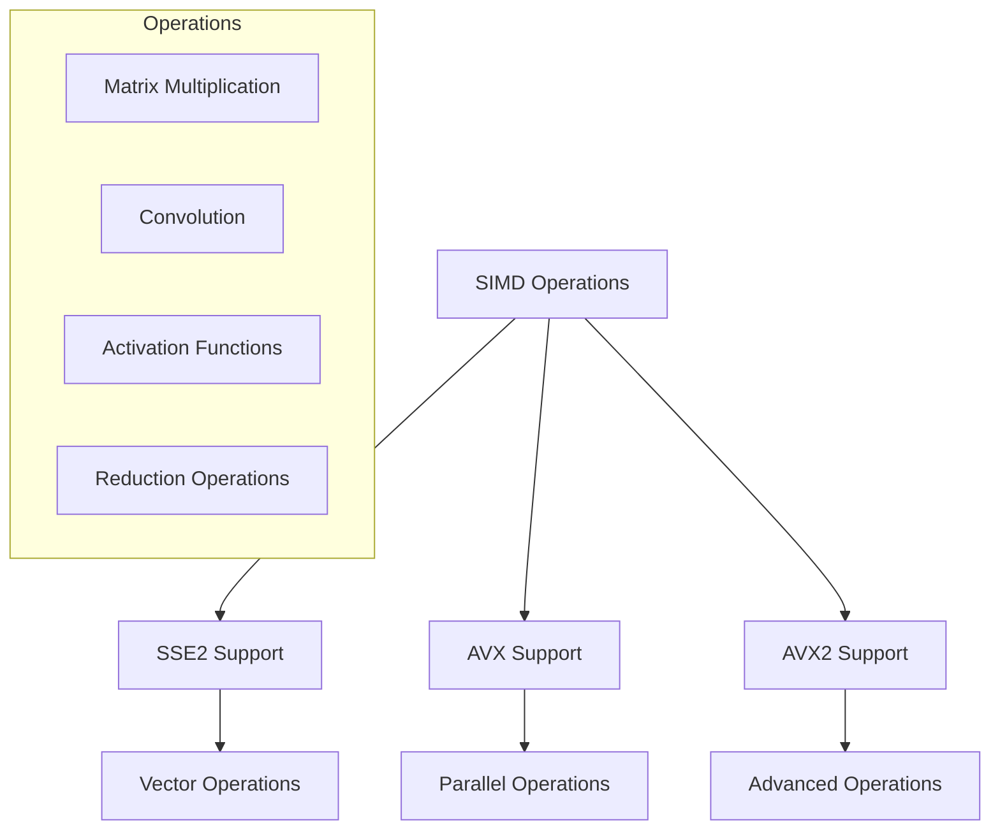

**SIMD Implementation:**
- **Cross-Platform**: Supports GCC, Clang, and MSVC compilers
- **Runtime Detection**: Automatic capability detection
- **Fallback Support**: Scalar implementations for unsupported hardware
- **Optimized Kernels**: Hand-tuned assembly for critical operations

## Hybrid Execution System

### Model Context Protocol (MCP) Integration

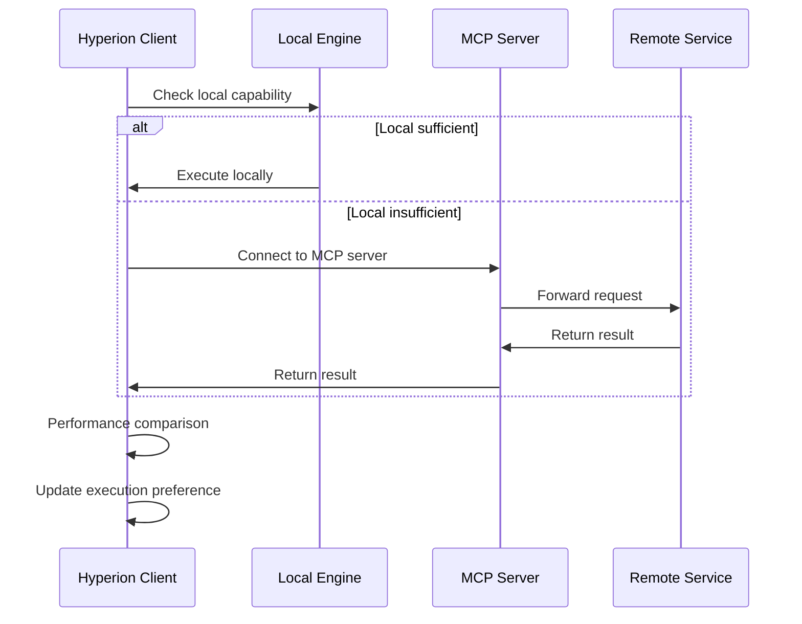

**Hybrid Features:**
- **Execution Preferences**: Always local, prefer local, prefer MCP, custom policy
- **Performance Monitoring**: Token/second tracking for local vs remote
- **Automatic Fallback**: Graceful degradation when remote unavailable
- **Connection Management**: Automatic reconnection and error handling

## Interface Architecture

### Command Line Interface

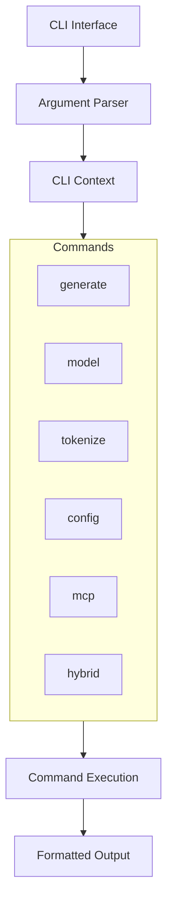

**CLI Features:**
- **Interactive Shell**: REPL environment with command history
- **Batch Processing**: Non-interactive script execution
- **Configuration**: File-based and command-line configuration
- **Help System**: Contextual help for all commands

### Web Interface

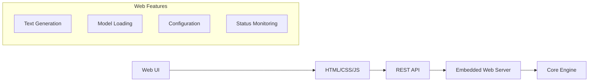

**Web Interface Components:**
- **Mongoose Server**: Embedded web server with minimal footprint
- **RESTful API**: JSON-based communication protocol
- **Real-time Updates**: WebSocket support for streaming responses
- **Mobile Responsive**: Optimized for various screen sizes

## Example Applications

### Chatbot Implementation

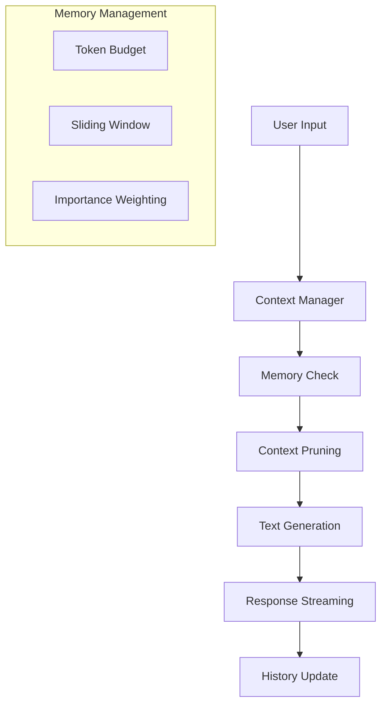

**Chatbot Features:**
- **Memory Constraints**: Operates within 16MB RAM limit
- **Context Management**: Intelligent conversation history pruning
- **Streaming Responses**: Token-by-token response generation
- **System Prompts**: Configurable personality and behavior

### Image Recognition Pipeline

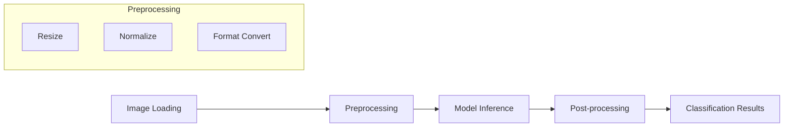

## Testing Strategy

### Test Coverage Architecture

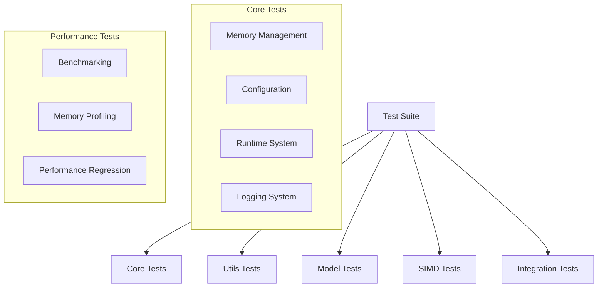

**Testing Components:**
- **Unit Tests**: Individual component testing with CTest integration
- **Integration Tests**: End-to-end pipeline testing
- **Performance Tests**: Memory usage and execution speed benchmarks
- **SIMD Tests**: Platform-specific optimization validation
- **Memory Tests**: Leak detection and usage analysis

## Performance Characteristics

### Memory Usage Profile

| Component | Memory Footprint | Optimization Strategy |
|-----------|------------------|----------------------|
| Tiny Model (2M params) | 8-16MB | 4-bit quantization |
| Small Model (5M params) | 20-40MB | Progressive loading |
| Medium Model (10M params) | 40-80MB | Hybrid execution |
| Context Buffer | 1-4MB | Sliding window |
| SIMD Buffers | 512KB-2MB | Pool allocation |

### Execution Performance

| Operation | Local Performance | Remote Performance | Hybrid Benefit |
|-----------|------------------|-------------------|----------------|
| Text Generation | 50-200 tokens/sec | 100-500 tokens/sec | 2-5x speedup |
| Image Classification | 10-50 images/sec | 20-100 images/sec | 2-4x speedup |
| Audio Processing | Real-time capable | Enhanced accuracy | Quality improvement |

## Configuration Management

### Configuration Hierarchy

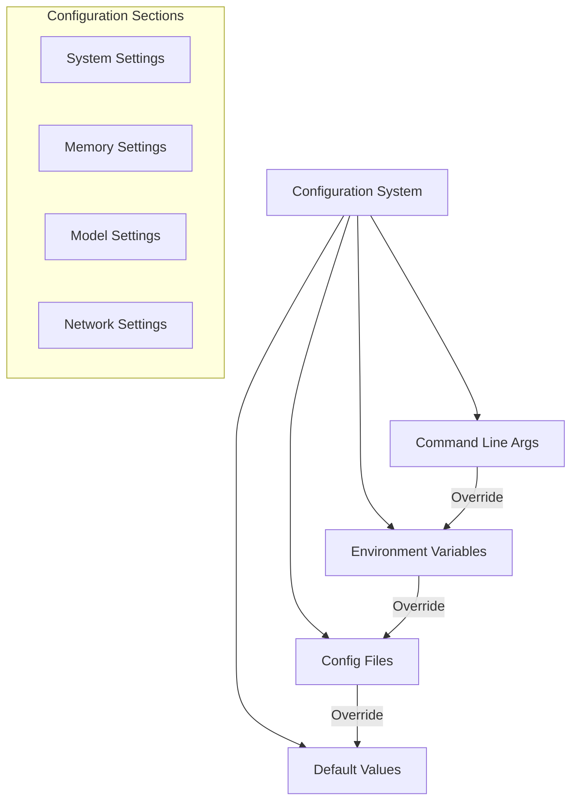

**Configuration Features:**
- **INI Format**: Human-readable configuration files
- **Environment Override**: Environment variable support
- **Runtime Modification**: Dynamic configuration updates
- **Validation**: Configuration value validation and defaults

## Build System

### CMake Build Configuration

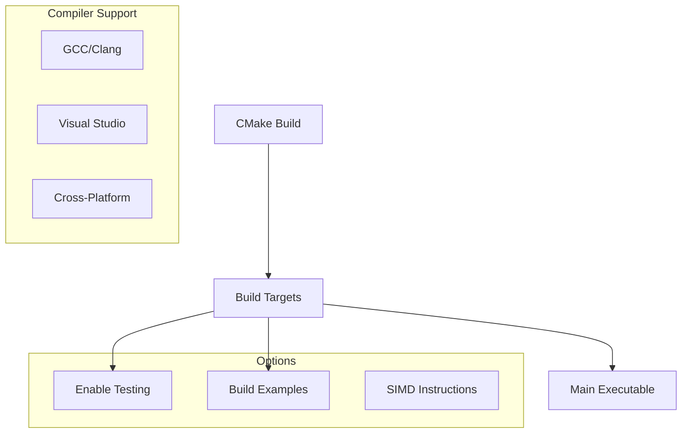

**Build Features:**
- **Cross-Platform**: Windows, Linux, macOS support
- **Compiler Options**: GCC, Clang, MSVC compatibility
- **Feature Flags**: Optional SIMD, examples, testing
- **Installation**: Standard CMake install targets