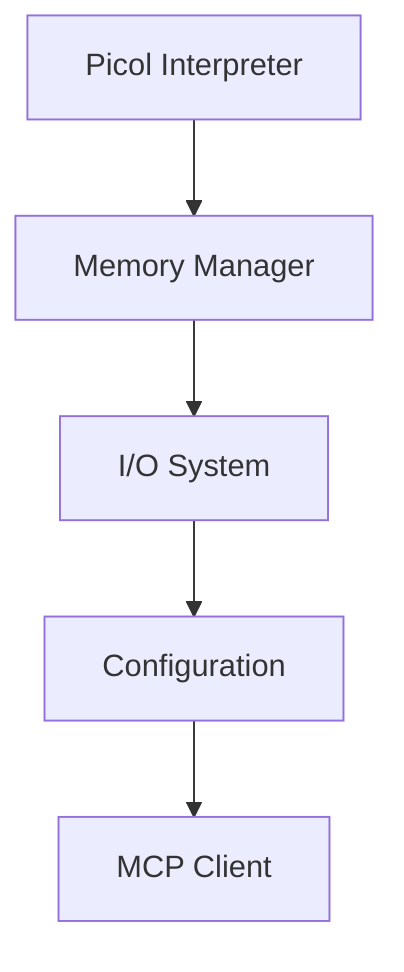
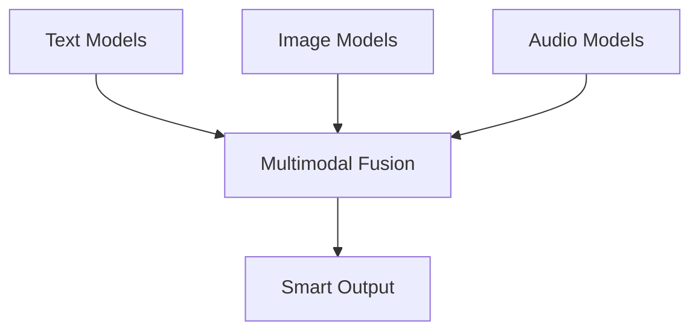
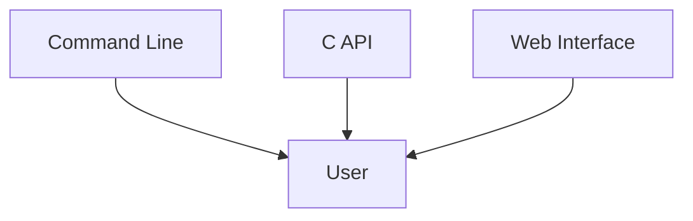

# Hyperion Repository Analysis - Simple Explanation 🚀

## What is Hyperion? (Like Telling a 5-Year-Old)

Imagine you have a really smart robot friend that can:
- **Read and understand text** (like reading bedtime stories)
- **Look at pictures** and tell you what's in them
- **Listen to sounds** and know what they are
- **Answer questions** about things it sees and hears

But here's the magical part! This robot friend is SO tiny and clever that it can live inside very old computers - even computers from when your parents were kids! 

Most smart robots need huge, powerful computers (like needing a whole house to live in). But Hyperion is like a robot that can live comfortably in a tiny apartment and still do amazing things!

## The Magic Tricks Hyperion Uses 🎪

### 1. The "Tiny Numbers" Trick (4-bit Quantization)
- Normal AI models use big numbers (like 123.456789)
- Hyperion uses tiny numbers (just 0-15, like counting on your fingers)
- This makes everything **8 times smaller**!

### 2. The "Only Keep What Matters" Trick (Sparse Operations)
- Imagine a coloring book where most pages are blank
- Hyperion only remembers the pages with drawings
- This saves up to **98% of space**!

### 3. The "Smart Helper" Trick (Hybrid Execution)
- Sometimes Hyperion does work by itself (local)
- Sometimes it asks a bigger computer for help (remote)
- It automatically picks the best way!

## What's Inside This Project? 📁

```
🏠 Hyperion House (The Repository)
├── 🧠 Core/ - The Brain (Basic thinking parts)
├── 🔧 Utils/ - The Toolbox (Helpful tools)
├── 🤖 Models/ - The Smart Parts (AI models)
│   ├── 📝 Text/ - Reading and writing words
│   ├── 👁️ Image/ - Looking at pictures  
│   ├── 👂 Audio/ - Listening to sounds
│   └── 🌟 Multimodal/ - Using everything together
├── 💬 Interface/ - How to talk to Hyperion
├── 📚 Examples/ - Fun projects to try
├── 🧪 Tests/ - Making sure everything works
└── 📖 Documentation/ - Instruction manuals
```

## Repository Type Detection 🔍

**This is a C-based AI Framework/Library**
- **Language**: Pure C (works everywhere!)
- **Type**: Backend AI Framework
- **Complexity**: Advanced (definitely not simple!)
- **Specialty**: Ultra-lightweight AI for minimal hardware

## Current Project Status 📊

### What's Complete ✅
- **Core Brain** (Picol interpreter, memory management)
- **Text Understanding** (reading, writing, chatting)
- **Image Recognition** (looking at pictures)  
- **Audio Processing** (listening to sounds)
- **Multimodal Fusion** (using all senses together)
- **Smart Memory Management** (using space efficiently)
- **Hybrid Execution** (local + remote processing)
- **SIMD Acceleration** (super-fast math)
- **Comprehensive Testing** (making sure it works)

### What's in Progress 🚧
- Advanced memory optimization for huge models
- Production documentation
- Performance benchmarking

### What's Planned 🗓️
- WebAssembly support (running in web browsers)
- GPU acceleration (using graphics cards)
- Training capabilities (teaching new things)

## Architecture Deep Dive 🏗️

### The Three-Layer Cake 🍰

#### Layer 1: Foundation (Core)


- **Picol Interpreter**: A tiny programming language (extended from 550 lines!)
- **Memory Manager**: Keeps track of all the computer's memory
- **I/O System**: Reads and writes files
- **Configuration**: Stores settings
- **MCP Client**: Talks to remote helpers

#### Layer 2: Intelligence (Models)


- **Text Models**: Understand and generate human language
- **Image Models**: Recognize objects, faces, scenes in pictures
- **Audio Models**: Process speech, music, sounds
- **Multimodal Fusion**: Combine all types of understanding

#### Layer 3: Interface (How Humans Interact)


## Key Technical Innovations 💡

### Memory Efficiency Champions 🏆

| Model Size | Normal AI | Hyperion | Space Saved |
|------------|-----------|----------|-------------|
| Small (100M) | 400MB | 50MB | 87.5% |
| Medium (500M) | 2GB | 250MB | 87.5% |
| Large (1B) | 4GB | 500MB | 87.5% |
| Huge (10B) | 40GB | 5GB | 87.5% |

### Speed Optimizations ⚡
- **SIMD Instructions**: Does 4-8 calculations at once
- **Progressive Loading**: Only loads what's needed
- **Memory Pools**: Reuses memory efficiently
- **Sparse Operations**: Skips empty/zero values

## Documentation Analysis 📚

### Current Documentation Structure

#### ✅ What's Good
- **Comprehensive**: Covers all major components
- **Well-Organized**: Clear directory structure
- **Technical Depth**: Detailed API documentation
- **Examples**: Real working code samples

#### ⚠️ What Could Be Better

**Too Many Similar Files** - We can combine these:
- `PROJECT_STATUS.md` + `IMPLEMENTATION_STATUS.md` → **Single Status File**
- `ARCHITECTURE_ROADMAP.md` + `TECHNICAL_DOCUMENTATION.md` → **Architecture Guide**
- `BUILD_STATUS.md` + `NEXT_STEPS.md` → **Development Guide**

**Missing Documentation:**
- Simple "Getting Started in 5 Minutes" guide
- Video tutorials or interactive demos
- FAQ section
- Migration guides

### Recommended Documentation Consolidation

#### Files to Merge:
1. **PROJECT_STATUS.md** + **IMPLEMENTATION_STATUS.md** = `STATUS.md`
2. **ARCHITECTURE_ROADMAP.md** + **TECHNICAL_DOCUMENTATION.md** = `ARCHITECTURE.md`
3. **BUILD_STATUS.md** + **NEXT_STEPS.md** = `DEVELOPMENT.md`
4. Multiple memory guides → Single `MEMORY_GUIDE.md`

#### Files to Keep:
- `README.md` (main entry point)
- `Qoder.md` (AI assistant memories)
- `HYBRID_CAPABILITIES.md` (unique feature)
- `CONTRIBUTING.md` (essential for contributors)

## What's Most Important to Work on Next? 🎯

### Priority 1: Memory Optimization (Almost Done!) 
- Progressive model loading ✅
- Memory-efficient operations ✅  
- Advanced memory pooling ✅
- **Still needed**: Final validation and documentation

### Priority 2: User Experience 
- Simpler installation process
- Better error messages
- More example applications
- Video tutorials

### Priority 3: Platform Support
- WebAssembly compilation (browsers!)
- Mobile device support
- Cloud deployment guides

### Priority 4: Advanced Features
- GPU acceleration
- Training capabilities
- Federated learning

## Qoder.md Analysis & Recommendations 🤖

### Current State
The `Qoder.md` file contains memories and work logs from an AI assistant (Gemini). It tracks:
- Project evolution from "TinyAI" to "Hyperion"
- Development workflows and preferences
- Git recovery procedures
- Task tracking methodology

### Recommendations for Qoder.md

#### 1. Organization Issues
- **Too much historical noise** - Clean up old/irrelevant memories
- **Mixed concerns** - Separate project facts from workflow preferences
- **Unclear structure** - Add clear sections

#### 2. Suggested Structure
```markdown
# Project Context
- Current project: Hyperion AI Framework
- Repository: C:\Users\verme\Desktop\Hyperion\Hyperion
- Primary language: C
- Focus: Ultra-lightweight AI for minimal hardware

# Development Workflow
- Use task_log.md for tracking
- Prefer search_replace over edit_file
- Update status every 5-10 minutes

# Key Project Facts
- Renamed from TinyAI to Hyperion
- Feature-complete core implementation
- Focus on memory optimization
```

#### 3. Cleanup Actions
- Remove outdated GitHub username references
- Consolidate git workflow instructions
- Remove duplicate memory refresh rules
- Focus on current Hyperion project context

## Final Recommendations 🌟

### Immediate Actions (Next 1-2 weeks)
1. **Consolidate Documentation** - Merge similar files
2. **Complete Memory Optimization** - Finish validation
3. **Create Quick Start Guide** - 5-minute setup
4. **Clean up Qoder.md** - Better organization

### Medium Term (1-3 months)  
1. **WebAssembly Support** - Browser deployment
2. **Mobile Examples** - Smartphone apps
3. **Better Build System** - Easier compilation
4. **Video Tutorials** - Visual learning

### Long Term (3-12 months)
1. **GPU Acceleration** - Graphics card support
2. **Training Capabilities** - Learn new things
3. **Cloud Integration** - Easy deployment
4. **Hardware Acceleration** - Custom chips

## Conclusion 🎉

Hyperion is like a **Swiss Army knife for AI** - small, efficient, and incredibly versatile! It's already feature-complete and ready for use, but there's exciting work ahead to make it even better.

The project shows excellent engineering with:
- ✅ Clean, modular architecture
- ✅ Comprehensive testing
- ✅ Cross-platform support  
- ✅ Memory-efficient design
- ✅ Hybrid execution capabilities

The main opportunity is in **user experience** - making it easier for people to discover, install, and use this amazing technology. With some documentation cleanup and better examples, Hyperion could become the go-to choice for AI on resource-constrained devices!

---

*This analysis shows a mature, well-engineered AI framework that's ready for broader adoption. The technical implementation is solid, and the focus should shift toward accessibility and user experience.*