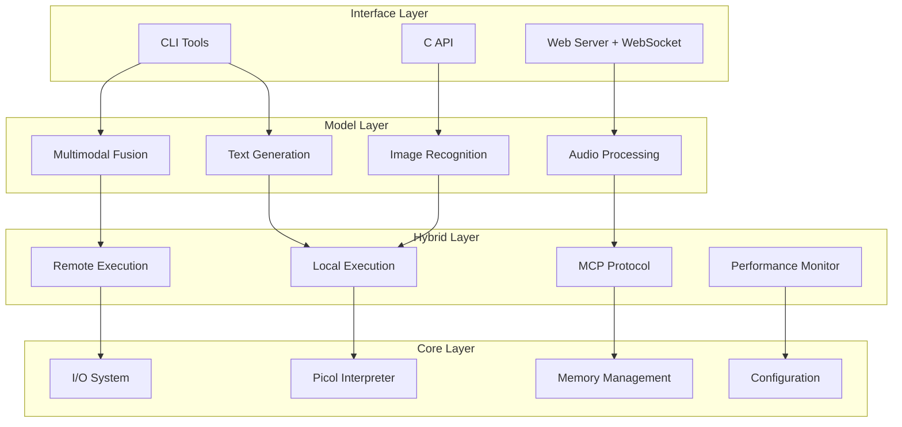

# 🚀 Hyperion - Ultra-Lightweight AI Framework

[](#building-hyperion) [](#memory-usage) [](#requirements) [](LICENSE)

**Hyperion** is an ultra-lightweight AI framework engineered for extreme memory efficiency and minimal hardware requirements. Using advanced 4-bit quantization and sparse matrix operations, Hyperion enables AI inference on devices with as little as **50-100MB of RAM** - making AI accessible on legacy systems and resource-constrained environments.

## 📚 Quick Navigation

| 🚀 **Get Started** | 📖 **Learn** | 🛠️ **Develop** | 🤝 **Contribute** |
|-------------------|--------------|----------------|-------------------|
| [Quick Start](QUICK_START.md) | [Architecture](ARCHITECTURE.md) | [Build Guide](DEVELOPMENT.md) | [Contributing](CONTRIBUTING.md) |
| [FAQ](FAQ.md) | [Status & Benchmarks](STATUS.md) | [Examples](examples/) | [Issues](../../issues) |
| [Installation](#building-hyperion) | [Hybrid Execution](HYBRID_CAPABILITIES.md) | [API Reference](#api-usage) | [Discussions](../../discussions) |

## 🌟 Key Features

### 🎢 Memory Efficiency
- **4-bit Quantization**: Reduces model size by up to **8x** compared to 32-bit floating point
- **Sparse Matrix Support**: CSR format with 4-bit quantization for up to **98% memory reduction**
- **Progressive Loading**: Components loaded on-demand to minimize memory footprint

### ⚡ Performance & Optimization
- **SIMD Acceleration**: Optimized matrix operations using AVX2, AVX, and SSE instructions
- **Cross-Platform**: Pure C implementation - works on modern to legacy systems
- **Minimal Dependencies**: No external library requirements

### 🌐 Hybrid Execution
- **Model Context Protocol (MCP)**: Seamlessly switch between local and remote execution
- **Performance Monitoring**: Track and compare local vs. remote execution performance
- **Intelligent Switching**: Automatic selection of optimal execution environment

### 🤖 AI Capabilities
- **Multiple Model Types**: RNN and Transformer architectures
- **Multimodal Support**: Text, image, audio, and combined processing
- **Flexible Generation**: Multiple sampling methods (greedy, top-k, top-p, temperature)
- **Real-time Processing**: WebSocket support for streaming applications

## 🏢 Architecture Overview

Hyperion follows a **4-layer architecture** designed for maximum efficiency and modularity:



### Layer Details

#### 🔌 **Interface Layer** - User Interaction
- **CLI Tools**: Interactive shell and command-line interface
- **C API**: Programmatic access for embedding in applications
- **Web Server**: RESTful API with WebSocket support for real-time applications

#### 🤖 **Model Layer** - AI Processing
- **Text Generation**: 4-bit quantized language models with multiple sampling strategies
- **Image Recognition**: Convolutional neural networks for image classification
- **Audio Processing**: Speech recognition and audio analysis
- **Multimodal Fusion**: Combined text, image, and audio processing

#### 🌐 **Hybrid Layer** - Execution Management
- **Local Execution**: Standalone operation without external dependencies
- **MCP Protocol**: Model Context Protocol for remote server communication
- **Remote Execution**: Offload processing to more powerful remote systems
- **Performance Monitor**: Real-time tracking and optimization recommendations

#### ⚙️ **Core Layer** - Foundation
- **Picol Interpreter**: Extended Tcl scripting environment for configuration
- **Memory Management**: Advanced memory pooling with 4-bit quantization support
- **I/O System**: Cross-platform file and network operations
- **Configuration**: Flexible configuration system with runtime updates

## 🛠️ Building Hyperion

> 🚀 **Quick Start**: For fastest setup, see our [5-minute Quick Start Guide](QUICK_START.md)

### Prerequisites
| Platform | Requirements |
|----------|-------------|
| **Windows** | Visual Studio 2022, CMake 3.10+ |
| **Linux** | GCC 7+, CMake 3.10+ |
| **macOS** | Xcode Command Line Tools, CMake 3.10+ |

### ⚡ Quick Build

```bash
# Clone and build in one step
git clone https://github.com/TheLakeMan/hyperion.git
cd hyperion && mkdir build && cd build

# Configure for your platform
cmake ..                                    # Linux/macOS
cmake -G "Visual Studio 17 2022" ..         # Windows

# Build
cmake --build . --config Release

# Test your installation
ctest -C Release
```

### 📝 Detailed Build Instructions

For comprehensive build instructions, troubleshooting, and advanced configuration options, see **[DEVELOPMENT.md](DEVELOPMENT.md)**.

## Using Hyperion

### Command Line Interface

The primary way to interact with Hyperion is through its command-line interface:

```bash
# Run the shell
./hyperion shell

# Generate text with a prompt
./hyperion generate "Once upon a time" --max-tokens 100 --temperature 0.7

# Load a custom model
./hyperion -m model.bin -t tokenizer.txt generate "Hello, world!"
```

### Interactive Shell

Hyperion provides an interactive shell for experimenting with models:

```
Hyperion Shell v0.1.0
Type 'help' for available commands, 'exit' to quit

> help
Available commands:
  help           Show help information
  generate       Generate text from a prompt
  tokenize       Tokenize text input
  model          Model management commands
  config         Configuration commands
  mcp            Model Context Protocol connections
  hybrid         Hybrid execution control
  exit           Exit the shell

> model load mymodel.bin
Loading model from mymodel.bin...

> generate "The quick brown fox" 50 0.8
Generating text (max 50 tokens, temp=0.80)...
The quick brown fox jumped over the lazy dog. The dog was not pleased with this arrangement and barked loudly. The fox, startled by the noise, scampered away into the forest.

> mcp connect mock://localhost:8080
Connecting to MCP server at mock://localhost:8080...
Connected to MCP server: Hyperion-MCP (version 0.1.0)

> hybrid on
Hybrid generation mode enabled.

> generate "The framework provides memory efficiency with" 30
Using hybrid generation mode...
Generation used local execution.
Local execution time: 12.45 ms
Tokens per second: 240.16
Generated Text:
The framework provides memory efficiency with 4-bit quantization, allowing it to run on devices with limited RAM. This approach makes it ideal for edge computing and embedded systems.
```

### Configuration

Hyperion can be configured through a configuration file (`hyperion.conf`) or command-line options:

```ini
# Hyperion Configuration File
system.name = "Hyperion"
system.version = "0.1.0"
system.data_dir = "./data"
system.model_dir = "./models"

# Memory settings
memory.pool_size = 1048576
memory.max_allocations = 10000
memory.track_leaks = true

# Model settings
model.context_size = 512
model.hidden_size = 256
model.temperature = 0.7
model.top_k = 40
model.top_p = 0.9
```

## API Usage

Hyperion can be embedded in your application through its C API:

### Basic Usage

```c
#include "hyperion.h"

int main() {
    // Initialize Hyperion
    hyperionIOInit();
    hyperionMemTrackInit();
    hyperionConfigInit();
    
    // Load model and tokenizer
    HyperionTokenizer *tokenizer = hyperionCreateTokenizer();
    hyperionLoadVocabulary(tokenizer, "tokenizer.txt");
    
    HyperionModel *model = hyperionLoadModel("model.bin", "weights.bin", "tokenizer.txt");
    
    // Set up generation parameters
    HyperionGenerationParams params;
    params.maxTokens = 100;
    params.samplingMethod = HYPERION_SAMPLING_TOP_P;
    params.temperature = 0.7f;
    params.topP = 0.9f;
    params.seed = time(NULL);
    
    // Encode prompt
    int promptTokens[64];
    int promptLength = hyperionEncodeText(tokenizer, "Hello, world!", promptTokens, 64);
    params.promptTokens = promptTokens;
    params.promptLength = promptLength;
    
    // Generate text
    int outputTokens[1024];
    int outputLength = hyperionGenerateText(model, &params, outputTokens, 1024);
    
    // Decode output
    char output[4096];
    hyperionDecodeTokens(tokenizer, outputTokens, outputLength, output, 4096);
    printf("Generated: %s\n", output);
    
    // Clean up
    hyperionDestroyModel(model);
    hyperionDestroyTokenizer(tokenizer);
    hyperionConfigCleanup();
    hyperionIOCleanup();
    hyperionMemTrackCleanup();
    
    return 0;
}
```

### Hybrid Execution Usage

```c
#include "hyperion.h"
#include "core/mcp/mcp_client.h"
#include "models/text/hybrid_generate.h"

int main() {
    // Initialize Hyperion
    hyperionIOInit();
    hyperionMemTrackInit();
    hyperionConfigInit();
    
    // Load model and tokenizer
    HyperionTokenizer *tokenizer = hyperionCreateTokenizer();
    hyperionLoadVocabulary(tokenizer, "tokenizer.txt");
    
    HyperionModel *model = hyperionLoadModel("model.bin", "weights.bin", "tokenizer.txt");
    
    // Set up MCP client for hybrid execution
    HyperionMcpConfig mcpConfig;
    hyperionMcpGetDefaultConfig(&mcpConfig);
    mcpConfig.execPreference = HYPERION_EXEC_PREFER_LOCAL; // Prefer local execution when possible
    
    // Create MCP client
    HyperionMcpClient *mcpClient = hyperionMcpCreateClient(&mcpConfig);
    
    // Connect to MCP server
    bool connected = hyperionMcpConnect(mcpClient, "mcp-server.example.com");
    
    // Create hybrid generation context
    HyperionHybridGenerate *hybridGen = hyperionCreateHybridGenerate(model, mcpClient);
    
    // Set up generation parameters
    HyperionGenerationParams params;
    params.maxTokens = 100;
    params.samplingMethod = HYPERION_SAMPLING_TOP_P;
    params.temperature = 0.7f;
    params.topP = 0.9f;
    params.seed = time(NULL);
    
    // Encode prompt
    int promptTokens[64];
    int promptLength = hyperionEncodeText(tokenizer, "Hello, world!", promptTokens, 64);
    params.promptTokens = promptTokens;
    params.promptLength = promptLength;
    
    // Generate text with hybrid execution
    int outputTokens[1024];
    int outputLength = hyperionHybridGenerateText(hybridGen, &params, outputTokens, 1024);
    
    // Get information about execution environment used
    bool usedRemote = hyperionHybridGenerateUsedRemote(hybridGen);
    
    // Get performance statistics
    double localTime, remoteTime, tokensPerSec;
    hyperionHybridGenerateGetStats(hybridGen, &localTime, &remoteTime, &tokensPerSec);
    
    printf("Execution used: %s\n", usedRemote ? "Remote" : "Local");
    printf("Time taken: %.2f ms\n", usedRemote ? remoteTime : localTime);
    printf("Performance: %.2f tokens/sec\n", tokensPerSec);
    
    // Decode output
    char output[4096];
    hyperionDecodeTokens(tokenizer, outputTokens, outputLength, output, 4096);
    printf("Generated: %s\n", output);
    
    // Clean up
    hyperionDestroyHybridGenerate(hybridGen);
    hyperionMcpDisconnect(mcpClient);
    hyperionMcpDestroyClient(mcpClient);
    hyperionDestroyModel(model);
    hyperionDestroyTokenizer(tokenizer);
    hyperionConfigCleanup();
    hyperionIOCleanup();
    hyperionMemTrackCleanup();
    
    return 0;
}
```

## Creating a Custom Model

To create a custom Hyperion model:

1. Train a model using your preferred framework (PyTorch, TensorFlow, etc.)
2. Convert the model to Hyperion format using the provided conversion tools
3. Quantize the model to 4-bit precision using `hyperionQuantizeModel`
4. Save the model, weights, and tokenizer using the Hyperion format

## 📦 Memory Usage Comparison

Hyperion's **4-bit quantization** and **sparse matrix optimization** deliver exceptional memory efficiency:

### 📉 Framework Comparison

| Model Size | 🚀 **Hyperion (4-bit)** | ONNX (int8) | PyTorch (fp16) | TensorFlow (fp16) | **Memory Savings** |
|------------|---------------------------|-------------|----------------|-------------------|-------------------|
| 100M params | **~50MB** ✅           | ~100MB      | ~200MB         | ~200MB            | **75-87% less** |
| 500M params | **~250MB** ✅          | ~500MB      | ~1GB           | ~1GB              | **75-87% less** |
| 1B params   | **~500MB** ✅          | ~1GB        | ~2GB           | ~2GB              | **75-87% less** |

### 🔋 Performance Characteristics
- **⚡ Startup Time**: Under 3 seconds for most models
- **📊 Token Generation**: 50-200 tokens/second on modest hardware
- **💾 Memory Footprint**: Stable, predictable memory usage
- **🔄 Real-time Capable**: Suitable for interactive applications

> 📈 **See [STATUS.md](STATUS.md)** for comprehensive benchmarks across different hardware configurations

## 📖 Documentation

### 📝 Core Documentation
| Document | Description | Quick Link |
|----------|-------------|------------|
| **[QUICK_START.md](QUICK_START.md)** | 5-minute setup guide | 🚀 Start Here |
| **[FAQ.md](FAQ.md)** | Common questions & troubleshooting | ❓ Get Help |
| **[STATUS.md](STATUS.md)** | Project status & benchmarks | 📈 See Progress |
| **[ARCHITECTURE.md](ARCHITECTURE.md)** | Technical architecture & design | 🏢 Deep Dive |
| **[DEVELOPMENT.md](DEVELOPMENT.md)** | Build guide & development workflow | 🛠️ Develop |
| **[CONTRIBUTING.md](CONTRIBUTING.md)** | Contribution guidelines | 🤝 Contribute |
| **[HYBRID_CAPABILITIES.md](HYBRID_CAPABILITIES.md)** | MCP integration & hybrid execution | 🌐 Advanced |

### 📚 Quick Access
- **🚀 Getting Started**: New to Hyperion? Start with [QUICK_START.md](QUICK_START.md)
- **🔧 Building & Setup**: See [DEVELOPMENT.md](DEVELOPMENT.md) for comprehensive build instructions
- **📁 Examples**: Explore `examples/` directory for practical applications
- **📈 Performance**: Check [STATUS.md](STATUS.md) for benchmarks and optimization results
- **🐛 Issues & Support**: Found a bug? Check [FAQ.md](FAQ.md) or create an issue

## Contributing

Contributions to Hyperion are welcome! Please see [CONTRIBUTING.md](CONTRIBUTING.md) for details.

## License

Hyperion is licensed under the MIT License. See [LICENSE](LICENSE) for details.