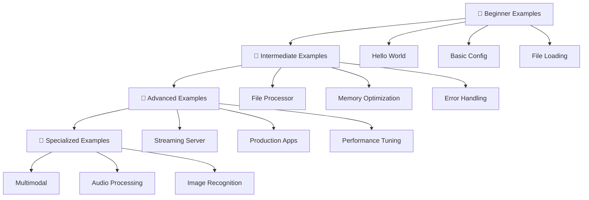

# 📚 Hyperion Examples Index

**Comprehensive examples organized by difficulty level** - Start with beginner examples and progress to advanced applications.

## 🗺️ Learning Path

Follow this recommended learning path to master Hyperion development:



## 🔰 Beginner Examples

**Perfect for first-time users** - Learn core concepts with minimal complexity.

### 📝 Hello World Text Generation
**File**: `beginner_hello_world.c`  
**Memory**: ~16MB | **Time**: 5 minutes | **Complexity**: ⭐☆☆☆☆

Your first Hyperion program! Perfect introduction to:
- Basic initialization and cleanup
- Simple model creation
- Text generation fundamentals
- Memory management basics

**Build & Run:**
```bash
gcc -o beginner_hello_world beginner_hello_world.c \
    ../core/memory.c ../core/config.c \
    ../models/text/generate.c ../models/text/tokenizer.c \
    -I.. -lm
./beginner_hello_world
```

**What you'll see:**
```
=== Hyperion Hello World Example ===
Step 1: Initializing Hyperion...
✓ Hyperion initialized successfully
...
Generated text: hello world the good nice
✓ Current memory usage: 8.45 MB
```

### 📋 More Beginner Examples
- **Configuration Basics** (Coming Soon) - Learn configuration management
- **File Loading** (Coming Soon) - Working with real model files  
- **Interactive Input** (Coming Soon) - Creating interactive applications

**📖 [Complete Beginner Guide →](BEGINNER.md)**

---

## 🔧 Intermediate Examples

**Build practical skills** - Real-world applications with optimization techniques.

### 📁 File-Based Text Processor
**File**: `intermediate_file_processor.c`  
**Memory**: 50-150MB | **Time**: 15 minutes | **Complexity**: ⭐⭐⭐☆☆

Professional text processing application featuring:
- Configuration file parsing
- Batch file processing
- Error handling and validation
- Memory optimization between batches
- Performance statistics tracking

**Build & Run:**
```bash
gcc -o intermediate_file_processor intermediate_file_processor.c \
    ../core/memory.c ../core/config.c ../core/io.c \
    ../models/text/generate.c ../models/text/tokenizer.c \
    -I.. -lm

# Create sample input
mkdir -p input output
echo "Hello world" > input/test.txt
./intermediate_file_processor
```

**Configuration File** (`processor.conf`):
```ini
model_path=models/text_model.bin
tokenizer_path=models/tokenizer.txt
input_directory=input/
output_directory=output/
max_tokens=200
temperature=0.7
batch_size=5
verbose=true
```

### 🔧 More Intermediate Examples
- **Memory Optimization** (Coming Soon) - Advanced memory management
- **Error Recovery** (Coming Soon) - Robust error handling strategies
- **Performance Monitoring** (Coming Soon) - Real-time performance tracking

---

## 🚀 Advanced Examples

**Production-ready applications** - Sophisticated features and enterprise-grade implementations.

### 🌊 Streaming Text Generation Server
**File**: `advanced_streaming_server.c`  
**Memory**: 100-300MB | **Time**: 30 minutes | **Complexity**: ⭐⭐⭐⭐⭐

Enterprise-grade streaming server with:
- Real-time text streaming
- Multi-threaded architecture
- Advanced error handling with context
- Performance monitoring and metrics
- Production logging and diagnostics
- SIMD optimization detection
- Graceful shutdown handling

**Build & Run:**
```bash
gcc -o advanced_streaming_server advanced_streaming_server.c \
    ../core/*.c ../models/text/*.c ../interface/web_server.c \
    ../utils/simd_benchmark.c -I.. -lm -lpthread

./advanced_streaming_server [model_path] [tokenizer_path]
```

**Features Demonstrated:**
- 🔄 Real-time streaming with callbacks
- 📊 Performance metrics and monitoring  
- 🛡️ Enhanced error handling with recovery
- 🧵 Multi-threaded server architecture
- 🚀 SIMD optimization and benchmarking
- 📝 Production-ready logging system

### 🚀 More Advanced Examples
- **Hybrid Execution** (Coming Soon) - Local/remote processing optimization
- **GPU Acceleration** (Coming Soon) - CUDA/OpenCL integration
- **Distributed Processing** (Coming Soon) - Multi-node deployment

---

## 🎨 Specialized Examples

**Domain-specific applications** - Complete applications for specific use cases.

### 🤖 Interactive Chatbot
**Location**: `chatbot/`  
**Memory**: 16-50MB | **Complexity**: ⭐⭐⭐☆☆

Complete chatbot implementation with:
- Memory-efficient conversation management
- Context pruning and optimization
- Real-time response streaming
- Persistent chat history

**Quick Start:**
```bash
cd chatbot/
./hyperion_chatbot --model ../models/chatbot.bin
```

### 🖼️ Image Recognition
**Location**: `image_recognition/`  
**Memory**: 20-80MB | **Complexity**: ⭐⭐⭐☆☆

Image classification system featuring:
- STB image loading (no dependencies)
- Convolutional neural network inference
- Batch processing capabilities
- Real-time classification

**Quick Start:**
```bash
cd image_recognition/
./hyperion_image_classify sample_image.jpg
```

### 🔊 Audio Processing
**Location**: `audio/`  
**Memory**: 8-120MB | **Complexity**: ⭐⭐⭐☆☆

Audio processing suite including:
- **Voice Activity Detection** (`voice_detection/`)
- **Speech Recognition** (`speech_recognition/`)  
- **Keyword Spotting** (`keyword_spotting/`)

### 🎭 Multimodal Processing
**Location**: `multimodal/`  
**Memory**: 100-300MB | **Complexity**: ⭐⭐⭐⭐☆

Advanced multimodal AI combining:
- Text understanding and generation
- Image recognition and description
- Audio processing and transcription
- Cross-modal attention mechanisms

### 🏷️ Media Tagging System
**Location**: `media_tagging/`  
**Memory**: 80-200MB | **Complexity**: ⭐⭐⭐⭐☆

Automated media organization with:
- Multi-format support (images, videos, audio)
- Hierarchical tagging system
- Batch processing optimization
- Custom vocabulary support

### 🌟 Complete Demo Application
**Location**: `complete_demo/`  
**Memory**: 150-400MB | **Complexity**: ⭐⭐⭐⭐⭐

Full-featured demonstration including:
- Web interface with real-time streaming
- All AI modalities integrated
- Performance monitoring dashboard
- User session management

---

## 📊 Quick Reference

### By Memory Usage
| Memory Range | Examples | Best For |
|--------------|----------|----------|
| **8-30MB** | Hello World, Voice Detection | Learning, Embedded |
| **30-100MB** | Chatbot, Image Recognition | Desktop Apps |
| **100-200MB** | File Processor, Audio Suite | Server Applications |
| **200MB+** | Streaming Server, Complete Demo | Production Systems |

### By Complexity Level
| Level | Examples | Prerequisites |
|-------|----------|---------------|
| **⭐☆☆☆☆** | Hello World, Basic Config | None |
| **⭐⭐☆☆☆** | Chatbot, Image Recognition | Basic C knowledge |
| **⭐⭐⭐☆☆** | File Processor, Audio Processing | File I/O, Error handling |
| **⭐⭐⭐⭐☆** | Multimodal, Media Tagging | Advanced C, Threading |
| **⭐⭐⭐⭐⭐** | Streaming Server, Complete Demo | Production experience |

### By Use Case
| Use Case | Recommended Examples | Skills Learned |
|----------|---------------------|----------------|
| **Learning Hyperion** | Hello World → Chatbot → File Processor | Core concepts, API usage |
| **Text Applications** | Chatbot → Streaming Server | Text generation, optimization |
| **Media Processing** | Image Recognition → Multimodal | Computer vision, cross-modal AI |
| **Production Systems** | File Processor → Streaming Server → Complete Demo | Scalability, monitoring |

## 🛠️ Build Tools & Scripts

### Quick Build All Examples
```bash
# Use CMake (recommended)
mkdir build && cd build
cmake .. -DBUILD_EXAMPLES=ON
cmake --build .

# Individual compilation
cd examples/
chmod +x build_all_examples.sh
./build_all_examples.sh
```

### Build Scripts
- **`build_all_examples.sh`** - Build all examples at once
- **`test_examples.sh`** - Run all examples with sample data
- **`clean_examples.sh`** - Clean build artifacts

### CMake Integration
Examples are integrated with the main CMake build system:
```cmake
# Enable examples in build
cmake .. -DBUILD_EXAMPLES=ON

# Build specific example
make beginner_hello_world
make intermediate_file_processor
make advanced_streaming_server
```

## 🎯 Getting Started Checklist

### First Time Setup
- [ ] Clone Hyperion repository
- [ ] Install build dependencies (gcc/clang, cmake)
- [ ] Build main Hyperion libraries
- [ ] Run beginner hello world example
- [ ] Explore chatbot example for practical usage

### Learning Path
- [ ] **Week 1:** Complete all beginner examples
- [ ] **Week 2:** Try intermediate file processor and error handling
- [ ] **Week 3:** Explore specialized examples (image, audio)
- [ ] **Week 4:** Build advanced streaming server
- [ ] **Week 5:** Create your own application using Hyperion

### Troubleshooting
- **Build errors:** Check [FAQ.md](../FAQ.md#build-issues)
- **Runtime issues:** See [FAQ.md](../FAQ.md#runtime-errors)
- **Performance problems:** Review [STATUS.md](../STATUS.md#performance-characteristics)
- **Get help:** Use [GitHub Discussions](../../discussions)

## 🌟 Contributing Examples

Want to add your own example? We welcome contributions!

### Example Contribution Guidelines
1. **Choose appropriate complexity level**
2. **Include comprehensive comments**
3. **Provide build instructions**
4. **Add performance expectations**
5. **Test on multiple platforms**

### Example Template Structure
```c
/**
 * Hyperion [Level] Example: [Name]
 * 
 * This [level] example demonstrates:
 * - Feature 1
 * - Feature 2
 * 
 * Memory Usage: X-Y MB
 * Complexity: ⭐⭐⭐☆☆ ([Level])
 */

// Example implementation...

/*
 * Build Instructions:
 * gcc command...
 * 
 * Usage:
 * ./example [args]
 * 
 * Features demonstrated:
 * - List of features
 */
```

**📝 [Contributing Guide →](../CONTRIBUTING.md)**

---

**🎉 Happy coding with Hyperion!** Start with the beginner examples and work your way up to building production-ready AI applications with ultra-lightweight memory usage.

**Next:** Choose your first example from the [🔰 Beginner section](#-beginner-examples) above!